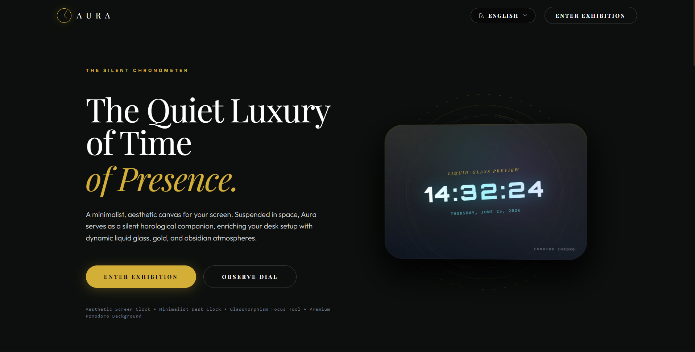

# AuraTime

> A minimalist, luxury screen clock.



## What is it?

AuraTime is a beautiful, distraction-free screen clock designed to enhance your workspace. Created in spare time as an open-source project, it serves as an elegant desktop background.

**Features:**
- Luxury themes: Emerald Gold, Liquid Glass, Obsidian Platinum, Frosted Glass
- Clock, Pomodoro, Stopwatch, Timer, Alarms
- Fully customizable: position, scale, angle, fonts
- Multilingual support
- All settings saved locally

## Quick Start

```bash
git clone https://github.com/JoaoMRB/AuraTime.git
cd AuraTime
npm install
npm start
```

Then open `http://localhost:4200`.

## Support

- **GitHub:** https://github.com/JoaoMRB/AuraTime
- **Buy me a coffee:** https://buymeacoffee.com/malog

---

Built with Angular, Tailwind CSS, and a passion for minimalism.

### Build

```bash
# Build com SSR
npm run build

# Servir com SSR
npm run serve:ssr:AuraTime
```

### Testes

```bash
# Testes unitários
npm test

# Modo headless (CI)
npm test -- --watch=false --browsers=ChromeHeadless
```

#### TimerService
```typescript
service.setTime(seconds: number): void
service.start(): void
service.pause(): void
service.reset(): void
```

#### PomodoroService
```typescript
service.start(): void
service.setWorkDuration(minutes: number): void
service.setBreakDuration(minutes: number): void
```

#### TranslationService
```typescript
service.t(path: string): string
service.setLanguage(lang: string): void
```

---
